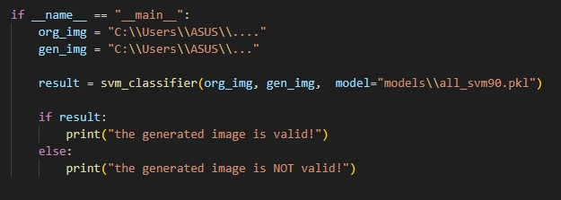
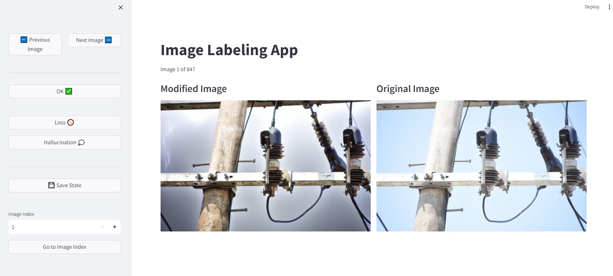

## Classifier Module
This module gets two image paths and a model name as inputs and returns a binary value predicting the validity of the synthesized image. In the figure below, you can see how to use it!

## Labeling App
This app is made to enable the annotator to see both the original and the synthesized image at the same time. This makes labeling much faster and more accurate for a task like this! 

to run the app, use this command: `streamlit run app.py`

