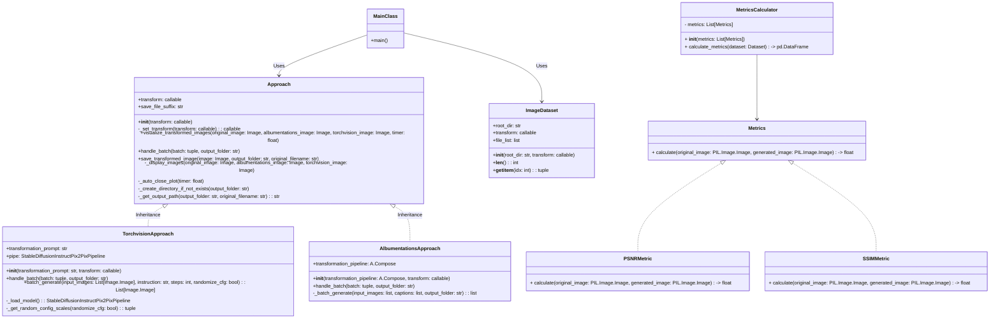

```mermaid
classDiagram

    Approach <|.. TorchvisionApproach: Inheritance
    Approach <|.. AlbumentationsApproach: Inheritance
    MainClass --> ImageDataset: Uses
    MainClass --> Approach: Uses

    Metrics <|.. PSNRMetric
    Metrics <|.. SSIMMetric

    MetricsCalculator --> Metrics

    class Approach {
        +transform: callable
        +save_file_suffix: str
        +__init__(transform: callable)
        -_set_transform(transform: callable): callable
        +visualize_transformed_images(original_image: Image, albumentations_image: Image, torchvision_image: Image, timer: float)
        +handle_batch(batch: tuple, output_folder: str)
        +save_transformed_image(image: Image, output_folder: str, original_filename: str)
        -_display_images(original_image: Image, albumentations_image: Image, torchvision_image: Image)
        -_auto_close_plot(timer: float)
        -_create_directory_if_not_exists(output_folder: str)
        -_get_output_path(output_folder: str, original_filename: str): str
    }

    class TorchvisionApproach {
        +transformation_prompt: str
        +pipe: StableDiffusionInstructPix2PixPipeline
        +__init__(transformation_prompt: str, transform: callable)
        +handle_batch(batch: tuple, output_folder: str)
        +batch_generate(input_images: List[Image.Image], instruction: str, steps: int, randomize_cfg: bool): List[Image.Image]
        -_load_model(): StableDiffusionInstructPix2PixPipeline
        -_get_random_config_scales(randomize_cfg: bool): tuple
    }

    class AlbumentationsApproach {
        +transformation_pipeline: A.Compose
        +__init__(transformation_pipeline: A.Compose, transform: callable)
        +handle_batch(batch: tuple, output_folder: str)
        -_batch_generate(input_images: list, captions: list, output_folder: str): list
    }

    class ImageDataset {
        +root_dir: str
        +transform: callable
        +file_list: list
        +__init__(root_dir: str, transform: callable)
        +__len__(): int
        +__getitem__(idx: int): tuple
    }

    class MainClass {
        +main()
    }


    class Metrics {
        + calculate(original_image: PIL.Image.Image, generated_image: PIL.Image.Image) -> float
    }

    class PSNRMetric {
        + calculate(original_image: PIL.Image.Image, generated_image: PIL.Image.Image) -> float
    }

    class SSIMMetric {
        + calculate(original_image: PIL.Image.Image, generated_image: PIL.Image.Image) -> float
    }

    class MetricsCalculator {
        - metrics: List[Metrics]
        + __init__(metrics: List[Metrics])
        + calculate_metrics(dataset: Dataset) -> pd.DataFrame
    }
```